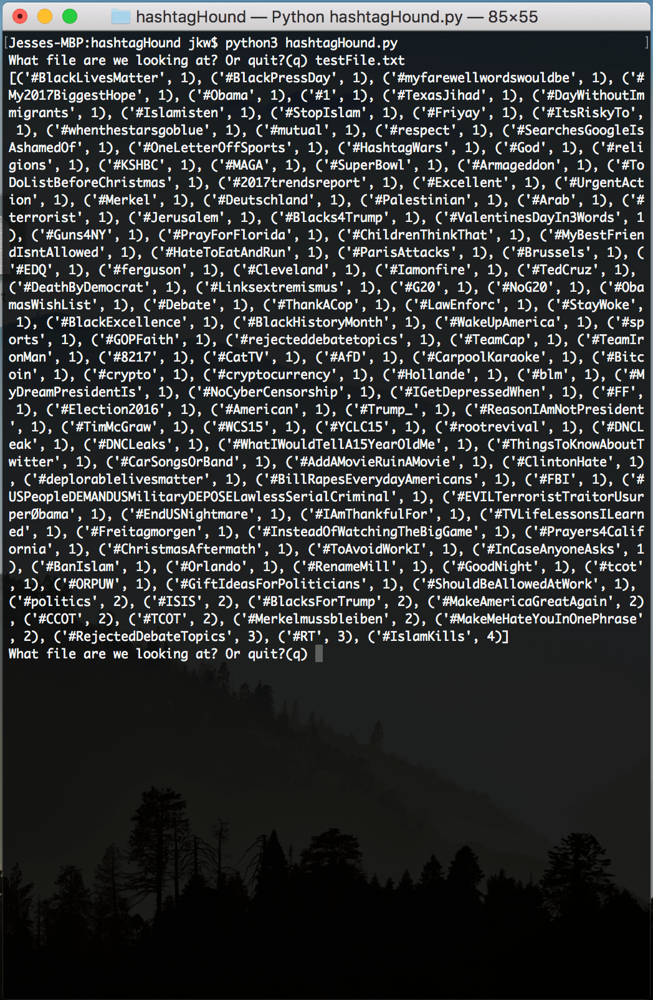
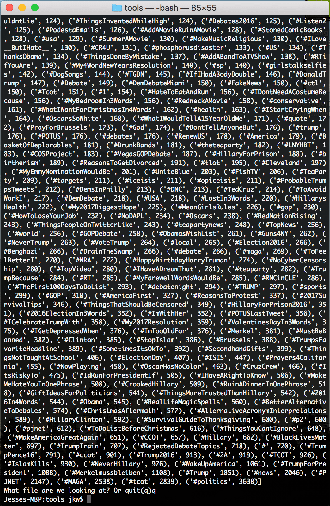

# Hashtag Hound

  The hashtag hound is a python script that runs through a file and sniffs out all of the hashtags.
It then places them into a dictionary and lists the number of times that hashtag appeared in the document.

  The idea came when twitter released a .csv with 200,000 russian bot tweets for analysis.
I was curious to see which tags were the most affected and decided to put python to work.

  There is a testFile.txt in the repository for you to use for testing. This file is a very small sample of the twitter .csv file.
If you would like to run it on the original file, you can find it here: https://www.nbcnews.com/tech/social-media/now-available-more-200-000-deleted-russian-troll-tweets-n844731.

Results of the small test file included here.

Results of the original twitter file.

## Getting Started

To run the hound just fork the file and run the script in your terminal with python 3. 
It will then prompt you for the file you want to scan. type in the path/to/file.txt and it will get to work.
The script will open the file and print the hashtag contents to your terminal.

It will then ask you for another file or if you want to quit.

### Prerequisites

All you need is python 3, a terminal, and a file to scan.

## Built With

* [python 3](https://www.python.org/) - The scripting langugage

## Versions

So far this is the first and only version. More features and capabilities are planned for the future.

## Authors

* **Jesse Kent Weaver** - *Initial work* - [H0bbyist](https://github.com/H0bbyist)

